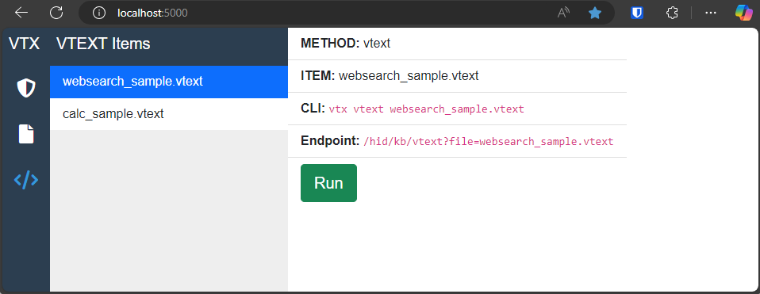

# virtex

The VIRTEX Bridge device is a multifunction USB device that runs on the Raspberry Pi Zero 2 to provide the following capabilities:
- Enable Wi-Fi access as either a Host or Access Point
- Emulate peripheral USB devices like keyboards, mice, network adapters
- Invoke virtual hardware functions remotely with REST API and command line functions.
- Provide a developer-friendly hosting platform for side-loading useful sotware.


## Hardware Setup
Complete hardware setup is covered in the [Hardware Setup Guide](docs/HardwareSetup.md).

## Software Setup
```bash
# Add your SSH key
eval `ssh-agent`
ssh-add ~/.ssh/GITHUB_KEY_FILE
git clone git@github.com:armunro/virtex.git
cd virtex/install
./install.sh
```
## Directory Structures
```bash
/root
  /virtex
    /VTX         # Root/Common code
    /VTXCli      # Command line tools
    /VTXHid      # Keyboard/Mouse entry methods
    /VTXHttp     # HTTP Control API
```

## Web UI
The WebUI is hosted from the `virtex-serve` service. It is currenty only hosted on `http://localhost:5000`. Until better HTTP security is implemented, SSH tunnels are recommended to facilitate remote access of the WebUI. `local 5000 -> localhost:5000`



## Command Line Usage
```bash
# Run a VTXT step file 
vtx run --file ~/sample.vtxt.yaml

# Send text using an interactive terminal
vtx console

# Link references to bitwarden items and send them
vtx bw -l "my bitwarden item to search for"
vtx bw 
```

## REST API Usage
```bash
# STEP 1: Create localhost:5000->5000 SSH tunnel
# Ensure virtex-serve is running
systemctl status virtex-serve

# Type a multi-line document
POST http://localhost:5000/hid/kb/string
...body...

# Type a simple string
GET http://localhost:5000/hid/kb/string?text=Hello World!

# Run a vtxt file
GET http://localhost:5000/hid/kb/vtext?file=ytest.vtext

# Run send a bitwarden secret
GET http://localhost:5000/hid/kb/bw?ref=aspx.bwref.yaml&template={username}%09{password}%0A

# Send a file in the `virtex-data/files`
GET http://localhost:5000/hid/kb/bw?file=test2.txt
```
